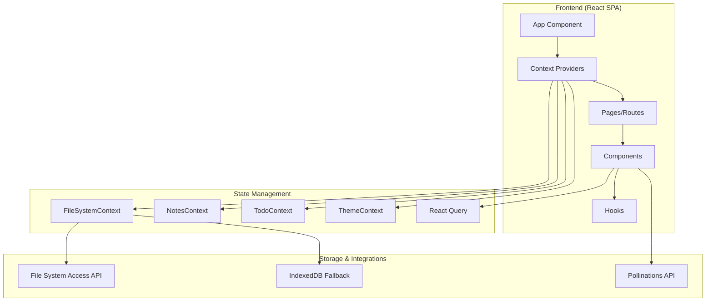
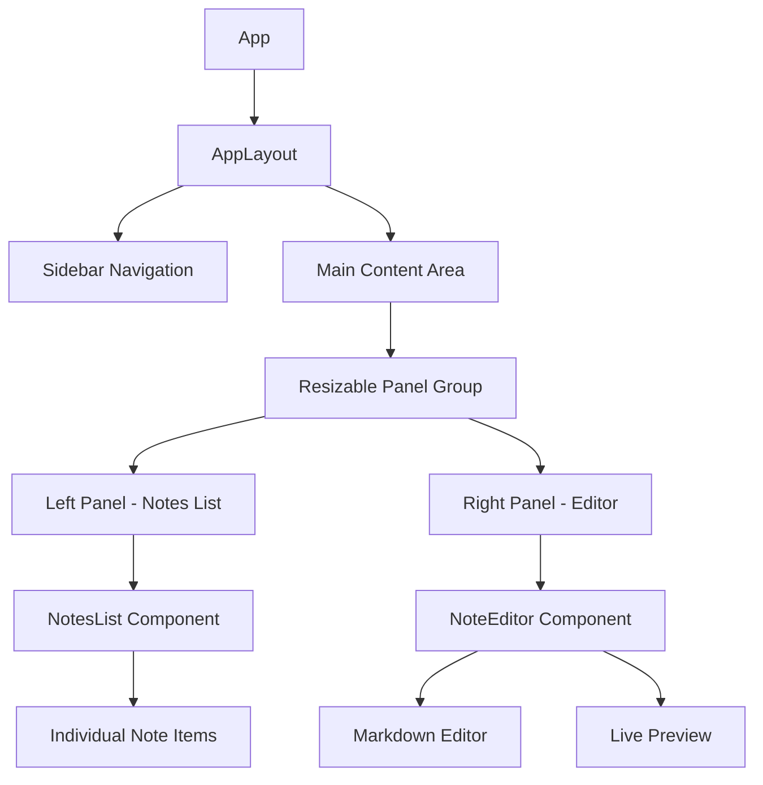
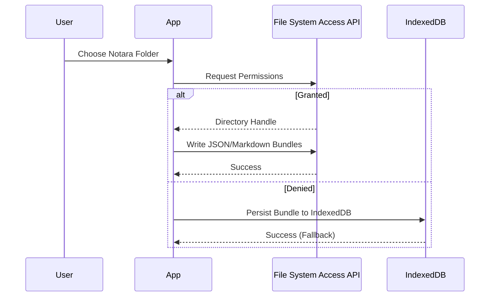
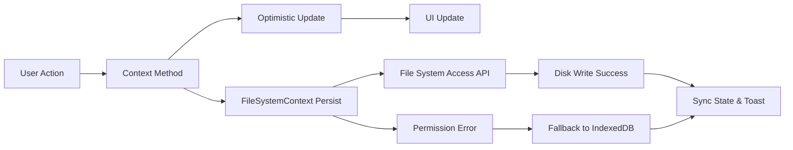

# 🏗️ Notara - Technical Overview

> **Version 1.0.0+** - Complete technical architecture and implementation guide  
> **Last Updated**: October 4, 2025

## 📋 Project Summary

**Notara** is a modern, feature-rich note-taking and personal knowledge management application built with React, TypeScript, and a local-first storage pipeline powered by the File System Access API. This document provides a comprehensive technical overview of the application's architecture, components, and implementation details.

### 🎯 Project Goals

- **Modern Note-Taking**: Rich markdown editing with real-time preview
- **Visual Organization**: Multiple ways to organize and visualize content
- **AI Integration**: Intelligent writing assistance and content generation  
- **Cross-Platform**: Web-first with responsive design
- **Local-First Ownership**: File-based sync without external authentication

## 🏛️ Architecture Overview

### High-Level Architecture



### 📁 Project Structure

```
src/
├── components/           # Reusable UI components
│   ├── layout/          # Layout components (AppLayout, Navigation)
│   ├── notes/           # Note-related components
│   ├── todos/           # Todo management components
│   └── ui/              # shadcn/ui base components
├── context/             # React Context providers
│   ├── AuthContext.tsx      # Legacy authentication state (deprecated)
│   ├── FileSystemContext.tsx # Local file system integration
│   ├── NotesContext.tsx     # Notes management
│   ├── TodoContext.tsx      # Todo management
│   └── ThemeContext.tsx     # UI theming
├── hooks/               # Custom React hooks
│   ├── use-mobile.tsx   # Mobile detection
│   └── use-toast.ts     # Toast notifications
├── lib/                 # Utility libraries
│   ├── supabase.ts      # Legacy Supabase helpers (kept for backward compatibility)
│   └── utils.ts         # General utilities
├── pages/               # Route components
│   ├── HomePage.tsx     # Main note editing interface
│   ├── TodoPage.tsx     # Todo management
│   ├── AuthPage.tsx     # Authentication
│   └── [other pages]
└── types/               # TypeScript type definitions
    └── index.ts         # Core data models
```

## 🗄️ Data Models

### Core Entities

#### Note
```typescript
interface Note {
  id: string;           // UUID
  title: string;        // Note title
  content: string;      // Markdown content
  createdAt: string;    // ISO timestamp
  updatedAt: string;    // ISO timestamp
  tags: NoteTag[];      // Associated tags
  isPinned: boolean;    // Starred/pinned status
}
```

#### NoteTag
```typescript
interface NoteTag {
  id: string;      // UUID
  name: string;    // Tag name
  color: string;   // Hex color code
}
```

#### TodoList
```typescript
interface TodoList {
  id: string;         // UUID
  title: string;      // List title
  date: string;       // Date (yyyy-MM-dd)
  time: string;       // Time (HH:mm)
  items: TodoItem[];  // Todo items
}
```

#### TodoItem
```typescript
interface TodoItem {
  id: string;              // UUID
  content: string;         // Item text
  checked: boolean;        // Completion status
  time: string;           // HH:mm format
  subItems?: TodoItem[];   // Nested sub-items
}
```

#### VisionBoard
```typescript
interface VisionBoard {
  id: string;                    // UUID
  name: string;                  // Board name
  items: VisionBoardItem[];      // Board items
}

interface VisionBoardItem {
  id: string;                           // UUID
  type: 'image' | 'text';              // Item type
  content: string;                      // Content/URL
  position: { x: number; y: number };  // Canvas position
  size?: { width: number; height: number }; // Optional sizing
}
```

## 🔧 Technical Stack

### Frontend Technologies

| Technology | Version | Purpose |
|-----------|---------|---------|
| **React** | 18.3.1 | UI framework with modern hooks |
| **TypeScript** | 5.5.3 | Type safety and developer experience |
| **Vite** | 6.3.4 | Fast build tool and dev server |
| **React Router** | 6.26.2 | Client-side routing |
| **TailwindCSS** | 3.4.17 | Utility-first styling |
| **React Query** | 5.56.2 | Server state management |

### UI Component Library

| Package | Purpose |
|---------|---------|
| **@radix-ui/react-\*** | Accessible component primitives |
| **shadcn/ui** | Pre-built component system |
| **lucide-react** | Icon library |
| **cmdk** | Command palette component |
| **prism-react-renderer** | Syntax-highlighted markdown preview |

### Storage & Integrations

| Service | Purpose |
|---------|---------|
| **File System Access API** | Writes JSON bundles and markdown files to the user-selected Notara folder |
| **IndexedDB** | Local fallback when filesystem permissions are unavailable |
| **Pollinations Proxy** | `/api/pollinations/*` Cloudflare Pages functions that forward chat/image requests with optional API token |

## 🤖 AI Assistant Integration

### Pollinations Request Flow

```
User ➜ React AI Assistant ➜ /api/pollinations/text|image ➜ Cloudflare Pages Function ➜ Pollinations API
```

- **Local Development**: Vite registers a middleware that mirrors the `/api/pollinations/*` routes. The middleware forwards requests to Pollinations, preserves streaming responses for chat completions, and injects an `Authorization` header when `VITE_POLLINATIONS_API_TOKEN` is present.
- **Production (Cloudflare Pages)**: Matching functions live at `functions/api/pollinations/text.ts` and `functions/api/pollinations/image.ts`. They accept either the caller's `Authorization` header or the `POLLINATIONS_API_TOKEN` secret configured via `wrangler secret put`.
- **Watermark Control**: The assistant always sets `referrer=notara` and forwards the `noLogo` flag. Supplying a Pollinations token is optional but recommended to guarantee watermark-free image generation.
- **Error Handling**: Both proxies return upstream status codes and plain-text messages so the UI can surface actionable toasts when Pollinations rejects a request.

## 🎨 UI/UX Architecture

### Theme System

The application features a sophisticated theming system with multiple themes:

- **Light Theme**: Clean, minimal design
- **Dark Theme**: Dark mode with proper contrast
- **Glass Theme**: Frosted glass effects with backdrop blur

#### Glass Theme Implementation
```css
/* Custom CSS variables for glass effects */
:root {
  --glass-bg: rgba(255, 255, 255, 0.1);
  --glass-border: rgba(255, 255, 255, 0.2);
  --backdrop-blur: blur(10px);
}

.glass-panel {
  background: var(--glass-bg);
  backdrop-filter: var(--backdrop-blur);
  border: 1px solid var(--glass-border);
}
```

### Layout System

- **Responsive Design**: Mobile-first approach with breakpoints
- **Resizable Panels**: Custom implementation using `react-resizable-panels`
- **Grid Layouts**: CSS Grid for complex layouts
- **Flexbox**: For component-level layouts

### Component Architecture



### Markdown Rendering Pipeline

- **ReactMarkdown + remark-gfm** convert note content into GitHub-flavoured HTML elements (tables, task lists, links)
- **prism-react-renderer** applies Night Owl theming and tokenizes fenced code blocks client-side
- **Responsive styling** wraps tables and images to prevent overflow in preview panes and dialogs

### Interaction Enhancements

- Global keyboard shortcuts: `Ctrl/Cmd+S` saves the active note, `Ctrl/Cmd+Shift+S` triggers Save All
- Save toasts clarify whether changes wrote to disk or temporarily remained in browser storage

## 📂 Local-First Storage Model

### Supabase Retirement

- **Removed Dependencies**: Supabase auth, database, and GitHub OAuth flows were deprecated in October 2025.
- **Legacy Artifacts**: `AuthContext` and `lib/supabase.ts` remain in the tree for historical reference but are no longer mounted in production builds.
- **Migration Path**: Existing users export their cloud data once, then adopt the local Notara folder workflow. No new Supabase environment variables are required.

### Current Storage Layers

1. **File System Access API** — Primary persistence to user-selected Notara directory (notes, tags, todos, AI cache).
2. **IndexedDB Fallback** — Automatic browser storage when filesystem permissions are missing or revoked.
3. **Runtime Memory** — React contexts manage in-session state and coordinate save pipelines.

### Permission & Save Flow



## 💾 State Management

### Context-Based Architecture

The application uses React Context for global state management:

#### NotesContext
- **Purpose**: Manages notes CRUD operations
- **State**: Notes array, active note, filters
- **Actions**: Create, read, update, delete, pin/unpin notes
- **Persistence**: Exposes `persistBundle()` so manual saves reuse the same filesystem pipeline as autosave

#### TodoContext  
- **Purpose**: Manages todo lists and items
- **State**: Todo lists, active list
- **Actions**: CRUD operations for lists and items

#### ThemeContext
- **Purpose**: Manages UI theming
- **State**: Current theme, theme preferences
- **Actions**: Switch themes, save preferences

### React Query Integration

Used for server state management:
- **Caching**: Automatic caching of API responses
- **Synchronization**: Background refetching
- **Optimistic Updates**: Immediate UI updates

## 🔄 Data Flow

### Note Management Flow



### Component Communication

1. **Props**: Parent-to-child data flow
2. **Context**: Global state access
3. **Custom Hooks**: Shared logic and state
4. **Event Callbacks**: Child-to-parent communication

### Filesystem Save Pipeline

1. **User Trigger**: Clicking Save, choosing *File ▸ Save Active Note*, or pressing `Ctrl/Cmd+S`
2. **Editor Dispatch**: `NoteEditor` assembles the current bundle and calls `persistBundle()` from `NotesContext`
3. **Filesystem Context**: `persistBundle()` routes through the File System Access API to write JSON bundles and per-note markdown files
4. **Fallback Handling**: If the Notara folder is unavailable, the bundle mirrors into browser storage and a toast explains the fallback
5. **Save All Shortcut**: `Ctrl/Cmd+Shift+S` runs the same pipeline for notes, todos, and cached AI history

## 🚀 Performance Optimizations

### Code Splitting
- **Route-based splitting**: Each page is lazy-loaded
- **Component splitting**: Large components are split

### React Optimizations
- **React.memo**: Prevents unnecessary re-renders
- **useMemo/useCallback**: Memoizes expensive computations
- **Virtualization**: For large lists (future enhancement)

### Bundle Optimization
- **Tree Shaking**: Removes unused code
- **Asset Optimization**: Image and font optimization
- **Chunk Splitting**: Optimal bundle sizes

## 🏗️ Build & Deployment

### Development Setup

```bash
# Install dependencies
npm install

# Environment setup
cp .env.example .env
# Optional: add VITE_POLLINATIONS_API_TOKEN for authenticated AI image requests

# Development server
npm run dev
```

### Build Configuration

- **Vite Configuration**: Fast builds with optimizations
- **TypeScript**: Strict mode enabled
- **ESLint**: Code quality and consistency
- **PostCSS**: TailwindCSS processing

### Deployment Options

1. **Cloudflare Pages**: Primary deployment target
2. **Netlify**: Alternative static hosting
3. **Vercel**: Another deployment option
4. **Self-hosted**: Docker containerization ready

### Build Scripts

```json
{
  "dev": "vite",                    // Development server
  "build": "vite build",           // Production build
  "build:dev": "vite build --mode development", // Dev build
  "lint": "eslint .",              // Code linting
  "preview": "vite preview",       // Preview build
  "deploy": "npm run deploy:cloudflare" // Deploy to Cloudflare
}
```

## 🔮 Future Enhancements

### Planned Features

1. **Offline Support**
   - Service Worker implementation
   - Local storage synchronization
   - Progressive Web App features

2. **Collaboration Features**
   - Real-time collaborative editing
   - Share notes with permissions
   - Comment system

3. **Advanced AI Integration**
   - More AI writing features
   - Content analysis and insights
   - Auto-tagging and categorization

4. **Mobile Applications**
   - React Native mobile apps
   - Native iOS and Android features
   - Offline-first mobile experience

5. **Plugin System**
   - Extensible architecture
   - Third-party integrations
   - Custom themes and components

### Technical Roadmap

- **Performance**: Further optimizations and monitoring
- **Testing**: Comprehensive test suite implementation
- **Documentation**: API documentation and guides
- **Accessibility**: Full WCAG compliance
- **Internationalization**: Multi-language support

## 🛠️ Development Guidelines

### Code Style

- **TypeScript**: Strict mode with explicit return types
- **ESLint**: Airbnb configuration with custom rules
- **Prettier**: Consistent code formatting
- **Components**: Functional components with hooks

### Component Patterns

- **Compound Components**: For complex UI patterns
- **Render Props**: For flexible component composition
- **Custom Hooks**: For shared stateful logic
- **Context + Reducer**: For complex state management

### File Naming Conventions

- **Components**: PascalCase (e.g., `NoteEditor.tsx`)
- **Hooks**: camelCase starting with 'use' (e.g., `useNotes.ts`)
- **Utilities**: camelCase (e.g., `formatDate.ts`)
- **Constants**: UPPER_SNAKE_CASE (e.g., `API_ENDPOINTS.ts`)

---

## 📊 Version History

### Version 1.0.0+ (Current - October 2025)
- **Local File Storage**: FileSystemContext integration with File System Access API
- **Manual Save Workflows**: Save button and File ▸ Save Active Note menu option
- **Keyboard Shortcuts**: `Ctrl/Cmd+S` for active note, `Ctrl/Cmd+Shift+S` for Save All
- **Enhanced Markdown Preview**: Prism React Renderer with VSCode-quality syntax highlighting
- **GitHub-Flavoured Markdown**: Tables, task lists, and enhanced formatting
- **Smart Notifications**: Save toasts indicate disk vs browser storage status
- **Supabase Deprecation**: Authentication and remote database requirements removed in favor of local-first storage

### Version 1.0.0 (2025-09-26)
- **Major Overhaul**: Complete modernization from cosmic theme
- **UI Improvements**: Glass theme implementation and layout fixes
- **New Features**: Starred notes page and enhanced navigation
- **Performance**: Optimized component architecture
- **Bug Fixes**: Context API improvements and layout issues

### Previous Versions
- **Pre-1.0**: Cosmic-themed prototype versions (deprecated)

---

**Made with ❤️ by Pink Pixel** ✨
