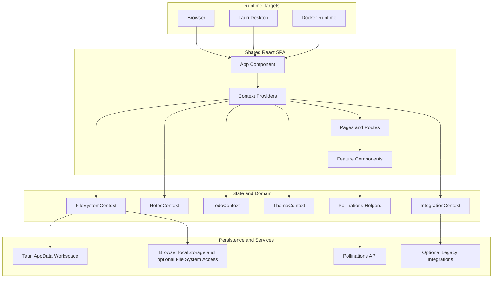
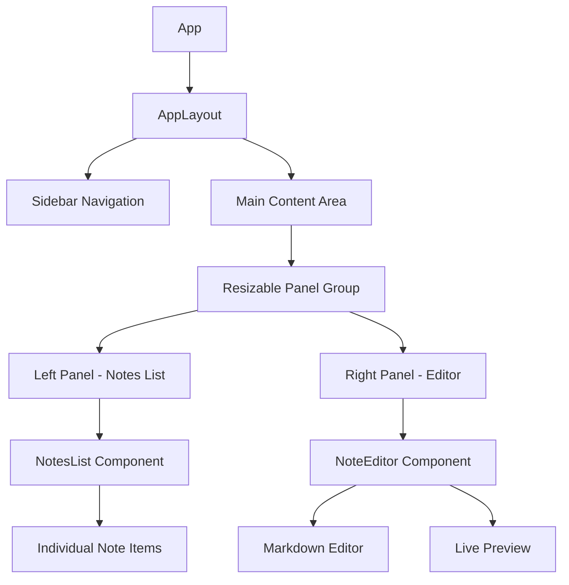
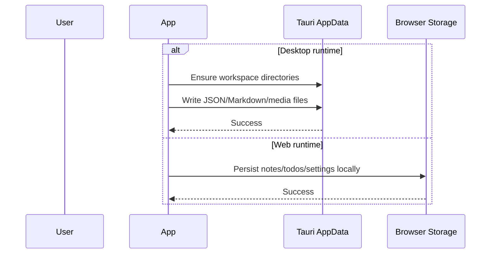
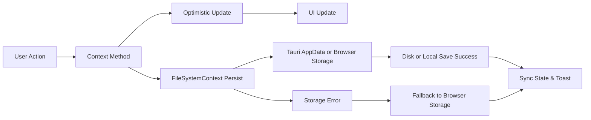

# 🏗️ Notara - Technical Overview

> **Version 1.1.0** - Current architecture and implementation guide
> **Last Updated**: March 13, 2026
> **Runtime Targets**: Web, Tauri desktop, Docker

## 🆕 Recent Release Highlights (v1.1.0)

- Default app appearance now starts in **Midnight + Pink** with global glass styling and adjustable glass intensity.
- Vision Boards now support **resize**, **inline text editing**, **item color coding**, and **persisted color filters**.
- Calendar right-side panel now uses **Upcoming/Selected Date tabs** with a quick **Today** shortcut.
- AI Assistant now supports configurable Pollinations key/model settings, stronger save workflows (chat archive + markdown note), and session chat continuity.
- Tauri desktop builds now package for Linux (`.deb`, `.rpm`, `AppImage`) and Windows (NSIS installer workflow).
- Desktop storage now persists automatically inside the Tauri app-data workspace.
- Docker delivery now serves the production SPA plus Pollinations proxy routes from a small Node runtime.

## 📋 Project Summary

**Notara** is a local-first note-taking and personal knowledge workspace built with React, TypeScript, and Vite. The app can run as:

- a browser-based SPA
- a Tauri desktop app for Linux and Windows
- a Dockerized self-hosted web runtime

The product centers on markdown notes, todos, vision boards, calendar organization, and Pollinations-powered AI workflows, with readable local storage and no required cloud account.

### 🎯 Project Goals

- **Modern Note-Taking**: Rich markdown editing with real-time preview
- **Visual Organization**: Multiple ways to organize and visualize content
- **AI Integration**: Intelligent writing assistance and content generation
- **Cross-Platform**: Web, desktop, and container delivery
- **Local-First Ownership**: File-based sync without mandatory external services

## 🏛️ Architecture Overview

### High-Level Architecture



### 📁 Project Structure

```text
src/
├── components/            # UI components, including AI, layout, notes, and shared primitives
├── context/               # React context providers for storage, notes, todos, theme, integrations
├── hooks/                 # Shared React hooks
├── lib/
│   ├── filesystem/        # Browser/Tauri storage abstraction layer
│   ├── integrations/      # Optional legacy integration subsystem
│   ├── pollinations.ts    # Runtime-aware AI transport and config helpers
│   ├── supabase.ts        # Legacy opt-in auth helpers
│   └── utils.ts           # Shared utilities
├── pages/                 # Route-level views
├── types/                 # Core data models
docker/
└── server.mjs             # Node runtime for Docker deployment
functions/
└── api/pollinations/      # Cloudflare Pages proxy endpoints
src-tauri/
├── capabilities/          # Tauri permission scopes
├── icons/                 # Desktop bundle icons
├── src/                   # Rust bootstrap
└── tauri.conf.json        # Desktop bundle configuration
```

### Delivery Targets

| Target | Runtime | Purpose |
| ------ | ------- | ------- |
| **Web** | Vite / Cloudflare Pages | Browser-first use and hosted deployment |
| **Tauri Desktop** | Tauri 2 + WebView | Linux and Windows installable desktop builds |
| **Docker** | Node 20 | Self-hosted containerized web runtime |

## 🗄️ Data Models

### Core Entities

#### Note

```typescript
interface Note {
  id: string; // UUID
  title: string; // Note title
  content: string; // Markdown content
  createdAt: string; // ISO timestamp
  updatedAt: string; // ISO timestamp
  tags: NoteTag[]; // Associated tags
  isPinned: boolean; // Starred/pinned status
}
```

#### NoteTag

```typescript
interface NoteTag {
  id: string; // UUID
  name: string; // Tag name
  color: string; // Hex color code
}
```

#### TodoList

```typescript
interface TodoList {
  id: string; // UUID
  title: string; // List title
  date: string; // Date (yyyy-MM-dd)
  time: string; // Time (HH:mm)
  items: TodoItem[]; // Todo items
}
```

#### TodoItem

```typescript
interface TodoItem {
  id: string; // UUID
  content: string; // Item text
  checked: boolean; // Completion status
  time: string; // HH:mm format
  subItems?: TodoItem[]; // Nested sub-items
}
```

#### VisionBoard

```typescript
interface VisionBoard {
  id: string; // UUID
  name: string; // Board name
  items: VisionBoardItem[]; // Board items
}

interface VisionBoardItem {
  id: string; // UUID
  type: "image" | "text"; // Item type
  content: string; // Content/URL
  position: { x: number; y: number }; // Canvas position
  size?: { width: number; height: number }; // Optional sizing
  accentColor?: string; // Optional item color for grouping/filtering
}
```

## 🔧 Technical Stack

### Frontend Technologies

| Technology | Version | Purpose |
| ---------- | ------- | ------- |
| **React** | 19.1.1 | UI framework with modern hooks |
| **TypeScript** | 5.5.3 | Type safety and developer experience |
| **Vite** | 7.3.1 | Fast build tool and dev server |
| **React Router** | 7.9.2 | Client-side routing |
| **TailwindCSS** | 3.4.17 | Utility-first styling |
| **TanStack Query** | 5.56.2 | Server state management |

### Desktop / Deployment Technologies

| Technology | Version | Purpose |
| ---------- | ------- | ------- |
| **Tauri** | 2.10.x | Desktop shell and bundle pipeline |
| **Tauri FS Plugin** | 2.4.x | Desktop-scoped filesystem access |
| **Tauri HTTP Plugin** | 2.5.x | Native desktop HTTP for Pollinations |
| **Docker** | Node 20 runtime | Self-hosted web runtime |
| **Cloudflare Pages Functions** | Current | Hosted proxy endpoints for the web app |

### UI Component Library

| Package                  | Purpose                             |
| ------------------------ | ----------------------------------- |
| **@radix-ui/react-\***   | Accessible component primitives     |
| **shadcn/ui**            | Pre-built component system          |
| **lucide-react**         | Icon library                        |
| **cmdk**                 | Command palette component           |
| **prism-react-renderer** | Syntax-highlighted markdown preview |

### Storage & Integrations

| Service | Purpose |
| ------- | ------- |
| **Tauri AppData Workspace** | Desktop persistence in the app-scoped local workspace |
| **Browser localStorage** | Web fallback persistence for notes, todos, and settings |
| **File System Access API** | Optional browser folder access in supported secure contexts |
| **Pollinations API** | Text and image generation backend |
| **Legacy Integrations** | Optional adapter framework for future/legacy sync providers |

## 🔄 Integration System

### Overview

The **Integration System** is now an optional legacy subsystem for syncing notes with external platforms like GitHub, Google Drive, and Dropbox. It remains in the repository, but the primary v1.1.0 product flow is local-first and does not depend on it.

### Architecture Components

```
┌─────────────────────────────────────────────────────────┐
│                   Integration System                     │
├─────────────────────────────────────────────────────────┤
│                                                          │
│  ┌──────────────┐  ┌──────────────┐  ┌──────────────┐ │
│  │   GitHub     │  │ Google Drive │  │   Dropbox    │ │
│  │   Adapter    │  │   Adapter    │  │   Adapter    │ │
│  └──────┬───────┘  └──────┬───────┘  └──────┬───────┘ │
│         │                  │                  │         │
│  ┌──────┴──────────────────┴──────────────────┴─────┐  │
│  │          IntegrationContext (State)               │  │
│  └────────────────────────┬──────────────────────────┘  │
│                           │                             │
│  ┌────────────────────────┴──────────────────────────┐  │
│  │         SyncOrchestrator (Queue, Retry)           │  │
│  └────────────────────────┬──────────────────────────┘  │
│                           │                             │
│  ┌────────────────────────┴──────────────────────────┐  │
│  │    TokenVault (Encrypted IndexedDB Storage)       │  │
│  └───────────────────────────────────────────────────┘  │
│                                                          │
└─────────────────────────────────────────────────────────┘
```

### Key Features

#### 🔒 Secure Token Storage (TokenVault)

- **Web Crypto API Encryption**: All OAuth tokens encrypted with AES-GCM (256-bit)
- **Device Fingerprinting**: Encryption key derived from unique device characteristics
- **IndexedDB Persistence**: Tokens stored client-side with zero backend dependency
- **Auto-Expiry Handling**: Automatically detects and manages expired tokens
- **Secure Key Derivation**: PBKDF2 with 100,000 iterations for key stretching

#### 🔄 Intelligent Sync Orchestration

- **Debounced Syncing**: Prevents excessive API calls during rapid edits (2-second delay)
- **Queue Management**: Manages concurrent sync operations safely
- **Exponential Backoff**: Automatic retry with increasing delays (2s, 4s, 8s, 16s, 32s max)
- **Conflict Detection**: Identifies when local and remote versions diverge
- **Background Sync**: Automatically triggered on note save/update when integrations are connected
- **Batch Operations**: Groups multiple note changes into single API calls when possible

#### 🎨 Rich UI Components

- **IntegrationCard**: Displays connection status, sync metrics, and configuration options
- **Status Indicators**: Real-time connection, syncing, error, and success states
- **Error Handling**: Clear error messages with actionable recovery steps
- **Metrics Dashboard**: Track sync success rates, last sync time, and note counts

#### 🧩 Extensible Adapter Pattern

- **Provider-Agnostic**: Easy to add new integration providers
- **Common Interface**: Consistent API across all adapters (`connect()`, `disconnect()`, `sync()`, `getStatus()`)
- **Async-First**: Built for modern async/await patterns
- **Type-Safe**: Full TypeScript coverage with strict interface contracts

### Development Status

| Provider     | Phase   | Status   | OAuth | Sync | Notes                          |
| ------------ | ------- | -------- | ----- | ---- | ------------------------------ |
| **GitHub**   | Phase 2 | 40% Done | 🚧    | ❌   | OAuth flow complete, needs API |
| Google Drive | Phase 3 | Planned  | ❌    | ❌   | Stub adapter created           |
| Dropbox      | Phase 3 | Planned  | ❌    | ❌   | Stub adapter created           |

#### Phase 1: Foundation (✅ Complete)

- [x] Feature flag system (global + per-provider toggles)
- [x] TypeScript type definitions for adapters, sync results, conflicts, metrics
- [x] TokenVault with Web Crypto API encryption
- [x] IntegrationContext for state management
- [x] IntegrationCard UI component
- [x] SyncOrchestrator with debouncing and retry logic
- [x] Adapter stubs for GitHub, Google Drive, Dropbox
- [x] Comprehensive integration documentation

#### Phase 2: GitHub OAuth (🚧 40% Complete)

- [x] OAuth helper utilities with PKCE support
- [x] Authorization URL builder with state/code_challenge
- [x] Token exchange via proxy endpoints (CORS fix)
- [x] Popup-based OAuth workflow with message passing
- [x] GitHub OAuth callback page with status UI
- [x] Token revocation on disconnect
- [x] Configuration persistence in localStorage
- [ ] Repository selection UI with search/filter
- [ ] Note-to-Markdown converter with YAML frontmatter
- [ ] GitHub API sync logic (Contents API integration)
- [ ] Conflict detection and resolution UI
- [ ] End-to-end testing and error handling

#### Phase 3: Google Drive & Dropbox (⏳ Planned)

- [ ] Google Drive OAuth flow
- [ ] Drive API folder sync implementation
- [ ] Dropbox OAuth flow
- [ ] Dropbox API file sync implementation

### Configuration

#### Environment Variables

```bash
# Global integrations toggle (master switch)
VITE_ENABLE_INTEGRATIONS=true

# Provider-specific toggles
VITE_ENABLE_GITHUB_INTEGRATION=true
VITE_ENABLE_GOOGLE_DRIVE_INTEGRATION=false
VITE_ENABLE_DROPBOX_INTEGRATION=false

# OAuth Credentials (Phase 2+)
VITE_GITHUB_OAUTH_CLIENT_ID=your_github_client_id
VITE_GITHUB_CLIENT_SECRET=your_github_client_secret  # Required for OAuth Apps
VITE_GOOGLE_DRIVE_API_KEY=your_google_api_key
VITE_DROPBOX_APP_KEY=your_dropbox_app_key
```

### Security Considerations

1. **Token Encryption**: All OAuth tokens encrypted before storage using AES-GCM with 256-bit keys
2. **PKCE Flow**: GitHub OAuth implements PKCE (Proof Key for Code Exchange) for enhanced security
3. **State Parameter**: CSRF protection via cryptographically random state values
4. **Proxy Endpoints**: Token exchanges happen through secure proxy to prevent client_secret exposure
5. **Automatic Cleanup**: Tokens are revoked and cleared on disconnection
6. **No Backend Storage**: All tokens stored client-side only, never sent to Notara servers

### Integration Context API

The `IntegrationContext` provides the following methods:

```typescript
interface IntegrationContextType {
  // Connection Management
  connectIntegration: (provider: IntegrationProvider) => Promise<boolean>;
  disconnectIntegration: (provider: IntegrationProvider) => Promise<void>;

  // Sync Operations
  syncIntegration: (provider: IntegrationProvider) => Promise<void>;
  syncAll: () => Promise<void>;

  // Status & Config
  getIntegrationStatus: (provider: IntegrationProvider) => IntegrationStatus;
  getIntegrationConfig: (
    provider: IntegrationProvider,
  ) => IntegrationConfig | null;
  updateConfig: (
    provider: IntegrationProvider,
    config: Partial<IntegrationConfig>,
  ) => void;

  // State
  integrations: Map<IntegrationProvider, IntegrationState>;
  syncInProgress: boolean;
  lastSyncTime: Date | null;
}
```

### Usage Example

```typescript
// Connect to GitHub
const success = await connectIntegration("github");
if (success) {
  // Configure repository
  updateConfig("github", {
    repository: "username/my-notes",
    branch: "main",
    folderPath: "notes/",
  });

  // Trigger manual sync
  await syncIntegration("github");
}

// Disconnect when done
await disconnectIntegration("github");
```

## 🤖 AI Assistant Integration

### Runtime Request Paths

| Runtime | Transport |
| ------- | --------- |
| **Tauri desktop** | Native `@tauri-apps/plugin-http` requests directly to `gen.pollinations.ai` |
| **Web development** | Vite `/api/pollinations/*` middleware proxy |
| **Cloudflare Pages** | `functions/api/pollinations/*` proxy endpoints |
| **Docker** | `docker/server.mjs` proxy endpoints |

### Pollinations Request Flow

```text
Desktop:  AI Assistant -> Tauri HTTP plugin -> gen.pollinations.ai
Web:      AI Assistant -> /api/pollinations/* -> proxy -> gen.pollinations.ai
Docker:   AI Assistant -> /api/pollinations/* -> docker/server.mjs -> gen.pollinations.ai
```

- Desktop requests use the Tauri HTTP plugin with explicit URL allow-listing and `Authorization` header support.
- Web and Docker runtimes preserve the browser-friendly `/api/pollinations/*` contract so the SPA can share one API surface.
- Pollinations configuration is user-editable in Settings and includes API key, text model, and image model preferences.
- Errors are surfaced as upstream status/text so the UI can show actionable failure messages.

## 🎨 UI/UX Architecture

### Theme System

The application features a sophisticated theming system with multiple themes:

- **Light Theme**: Clean, minimal design
- **Dark Theme**: Dark mode with proper contrast
- **Glass Theme**: Frosted glass effects with backdrop blur

#### Glass Theme Implementation

```css
/* Custom CSS variables for glass effects */
:root {
  --glass-bg: rgba(255, 255, 255, 0.1);
  --glass-border: rgba(255, 255, 255, 0.2);
  --backdrop-blur: blur(10px);
}

.glass-panel {
  background: var(--glass-bg);
  backdrop-filter: var(--backdrop-blur);
  border: 1px solid var(--glass-border);
}
```

### Layout System

- **Responsive Design**: Mobile-first approach with breakpoints
- **Resizable Panels**: Custom implementation using `react-resizable-panels`
- **Grid Layouts**: CSS Grid for complex layouts
- **Flexbox**: For component-level layouts

### Component Architecture



### Markdown Rendering Pipeline

- **ReactMarkdown + remark-gfm** convert note content into GitHub-flavoured HTML elements (tables, task lists, links)
- **prism-react-renderer** applies Night Owl theming and tokenizes fenced code blocks client-side
- **Responsive styling** wraps tables and images to prevent overflow in preview panes and dialogs
- **rehype-raw + rehype-sanitize** allow safe inline colour spans, highlights, and remote images by extending the sanitizer while keeping scripts/styles blocked

### Interaction Enhancements

- Global keyboard shortcuts: `Ctrl/Cmd+S` saves the active note, `Ctrl/Cmd+Shift+S` triggers Save All
- Save toasts clarify whether changes wrote to disk or temporarily remained in browser storage
- Markdown toolbar surfaces headings, lists, quotes, code blocks, inline styles, colour accents, highlights, and quick link/image prompts without manual syntax
- Header toolbar houses a dedicated Tags icon, while pinning swaps to a prominent star glyph that mirrors the note list indicator
- Settings ▸ Tags consolidates tag creation, renaming, colour selection, deletion, and displays per-tag usage counts sourced from `NotesContext`

## 📂 Local-First Storage Model

### Supabase Retirement (Opt-In Legacy Mode)

- **Removed Dependencies**: Supabase auth, database, and GitHub OAuth flows were deprecated in October 2025 and are now disabled by default.
- **Legacy Artifacts**: `AuthContext` and `lib/supabase.ts` remain for backwards compatibility and only initialise when `VITE_ENABLE_AUTH=true` with valid Supabase keys.
- **Migration Path**: Local-first users can ignore Supabase entirely; teams needing the legacy workflow can re-enable it explicitly without touching the default experience.

### Current Storage Layers

1. **Tauri AppData Workspace** — Desktop persistence to the app-scoped local workspace.
2. **Browser localStorage** — Web fallback persistence for notes, todos, AI settings, and UI state.
3. **IndexedDB** — Browser storage for persisted directory-handle metadata when File System Access is available.
4. **Optional File System Access API** — Browser-only folder access in secure contexts.
5. **Runtime Memory** — React contexts coordinate in-session state and save flows.

### Permission & Save Flow



### Desktop Workspace Layout

On Linux, the default Tauri storage location is:

- `~/.local/share/dev.pinkpixel.notara/workspace/`

If `XDG_DATA_HOME` is present, Tauri resolves the workspace relative to that directory instead.

Typical files written under the workspace include:

- `data/notes/notes.json`
- `data/notes/tags.json`
- `data/notes/markdown/*.md`
- `data/todos/todos.json`
- `data/ai/conversations.json`
- `data/media/*`

## 💾 State Management

### Context-Based Architecture

The application uses React Context for global state management:

#### NotesContext

- **Purpose**: Manages notes CRUD operations
- **State**: Notes array, active note, filters
- **Actions**: Create, read, update, delete, pin/unpin notes
- **Persistence**: Exposes `persistBundle()` so manual saves reuse the same filesystem pipeline as autosave

#### TodoContext

- **Purpose**: Manages todo lists and items
- **State**: Todo lists, active list
- **Actions**: CRUD operations for lists and items

#### ThemeContext

- **Purpose**: Manages UI theming
- **State**: Current theme, theme preferences
- **Actions**: Switch themes, save preferences

### React Query Integration

Used sparingly for async/server-adjacent state:

- **Caching**: Automatic caching of API responses
- **Synchronization**: Background refetching
- **Optimistic Updates**: Immediate UI updates

## 🔄 Data Flow

### Note Management Flow



### Component Communication

1. **Props**: Parent-to-child data flow
2. **Context**: Global state access
3. **Custom Hooks**: Shared logic and state
4. **Event Callbacks**: Child-to-parent communication

### Filesystem Save Pipeline

1. **User Trigger**: Clicking Save, choosing _File ▸ Save Active Note_, or pressing `Ctrl/Cmd+S`
2. **Editor Dispatch**: `NoteEditor` assembles the current bundle and calls `persistBundle()` from `NotesContext`
3. **Filesystem Context**: `persistBundle()` routes through the runtime-aware storage layer to write JSON bundles and per-note markdown files
4. **Desktop Path**: In Tauri, writes land in the app-data workspace and media files are saved into `data/media`
5. **Web Path**: In browsers, the app falls back to local storage and optional File System Access behavior where supported
6. **Save All Shortcut**: `Ctrl/Cmd+Shift+S` runs the same pipeline for notes, todos, and cached AI history

## 🚀 Performance Optimizations

### Code Splitting

- **Route-based splitting**: Each page is lazy-loaded
- **Component splitting**: Large components are split

### React Optimizations

- **React.memo**: Prevents unnecessary re-renders
- **useMemo/useCallback**: Memoizes expensive computations
- **Virtualization**: For large lists (future enhancement)

### Bundle Optimization

- **Tree Shaking**: Removes unused code
- **Asset Optimization**: Image and font optimization
- **Chunk Splitting**: Optimal bundle sizes

## 🏗️ Build & Deployment

### Development Setup

```bash
# Install dependencies
npm install

# Environment setup
cp .env.example .env
# Optional: add VITE_POLLINATIONS_API_TOKEN for authenticated AI image requests

# Development server
npm run dev
```

### Build Configuration

- **Vite Configuration**: Fast builds with optimizations
- **TypeScript**: Strict mode enabled
- **ESLint**: Code quality and consistency
- **PostCSS**: TailwindCSS processing

### Deployment Options

1. **Tauri Desktop**: Linux packages and Windows installer workflow
2. **Cloudflare Pages**: Primary hosted web deployment target
3. **Self-hosted Docker**: Containerized web runtime with Pollinations proxy support
4. **Static SPA Hosting**: Possible for the frontend, but AI proxy routes need a matching backend/proxy layer

### Build Scripts

```json
{
  "dev": "vite",
  "build": "vite build",
  "build:dev": "vite build --mode development",
  "lint": "eslint .",
  "preview": "vite preview",
  "tauri:dev": "tauri dev",
  "tauri:build:linux": "NO_STRIP=YES tauri build --bundles deb,appimage",
  "deploy": "npm run deploy:cloudflare"
}
```

### Release Artifacts

Current packaged outputs for `v1.1.0`:

- `Notara_1.1.0_amd64.deb`
- `Notara-1.1.0-1.x86_64.rpm`
- `Notara_1.1.0_amd64.AppImage`
- `Notara_1.1.0_x64-setup.exe`

## 🔮 Future Enhancements

### Planned Features

1. **Offline Support**
   - Service Worker implementation
   - Local storage synchronization
   - Progressive Web App features

2. **Collaboration Features**
   - Real-time collaborative editing
   - Share notes with permissions
   - Comment system

3. **Advanced AI Integration**
   - More AI writing features
   - Content analysis and insights
   - Auto-tagging and categorization

4. **Mobile Applications**
   - React Native mobile apps
   - Native iOS and Android features
   - Offline-first mobile experience

5. **Plugin System**
   - Extensible architecture
   - Third-party integrations
   - Custom themes and components

### Technical Roadmap

- **Performance**: Further optimizations and monitoring
- **Testing**: Comprehensive test suite implementation
- **Documentation**: API documentation and guides
- **Accessibility**: Full WCAG compliance
- **Internationalization**: Multi-language support

## 🛠️ Development Guidelines

### Code Style

- **TypeScript**: Strict mode with explicit return types
- **ESLint**: Airbnb configuration with custom rules
- **Prettier**: Consistent code formatting
- **Components**: Functional components with hooks

### Component Patterns

- **Compound Components**: For complex UI patterns
- **Render Props**: For flexible component composition
- **Custom Hooks**: For shared stateful logic
- **Context + Reducer**: For complex state management

### File Naming Conventions

- **Components**: PascalCase (e.g., `NoteEditor.tsx`)
- **Hooks**: camelCase starting with 'use' (e.g., `useNotes.ts`)
- **Utilities**: camelCase (e.g., `formatDate.ts`)
- **Constants**: UPPER_SNAKE_CASE (e.g., `API_ENDPOINTS.ts`)

---

## 📊 Version History

### Version 1.1.0 (Current - March 2026)

- **Visual Theming Refresh**: Midnight + Pink defaults, Aurora mode, and app-wide glass with adjustable intensity.
- **Vision Board Expansion**: Resize handles, inline note editing, richer color palette, color picker modal, and per-board persisted color filters.
- **Calendar UX Upgrade**: Upcoming-first event panel with dynamic Selected Date tab and Today quick jump.
- **AI Workflow Improvements**: Pollinations settings for API key/model selection, better chat persistence, save-chat markdown archival, and improved generated image save paths.
- **Stability Improvements**: Tooltip layering fixes, global search focus wiring, and canvas gradient color normalization in Constellation.

### Version 1.0.0+ (October 2025)

- **Integration System Phase 1 (Complete)**: Secure token vault with Web Crypto API, SyncOrchestrator with exponential backoff, IntegrationContext state management, IntegrationCard UI, adapter pattern for GitHub/Drive/Dropbox
- **Integration System Phase 2 (40% Complete)**: GitHub OAuth flow with PKCE, popup-based authentication, proxy endpoints for CORS handling, callback page with status UI, token storage and revocation
- **Local File Storage**: FileSystemContext integration with File System Access API
- **Manual Save Workflows**: Save button and File ▸ Save Active Note menu option
- **Keyboard Shortcuts**: `Ctrl/Cmd+S` for active note, `Ctrl/Cmd+Shift+S` for Save All
- **Enhanced Markdown Preview**: Prism React Renderer with VSCode-quality syntax highlighting
- **GitHub-Flavoured Markdown**: Tables, task lists, and enhanced formatting
- **Smart Notifications**: Save toasts indicate disk vs browser storage status
- **Supabase Deprecation**: Authentication and remote database requirements removed in favor of local-first storage
- **Pollinations AI Proxy**: Development and production endpoints for chat and image generation with optional API token support

### Version 1.0.0 (2025-09-26)

- **Major Overhaul**: Complete modernization from cosmic theme
- **UI Improvements**: Glass theme implementation and layout fixes
- **New Features**: Starred notes page and enhanced navigation
- **Performance**: Optimized component architecture
- **Bug Fixes**: Context API improvements and layout issues

### Previous Versions

- **Pre-1.0**: Cosmic-themed prototype versions (deprecated)

---

**Made with ❤️ by Pink Pixel** ✨
