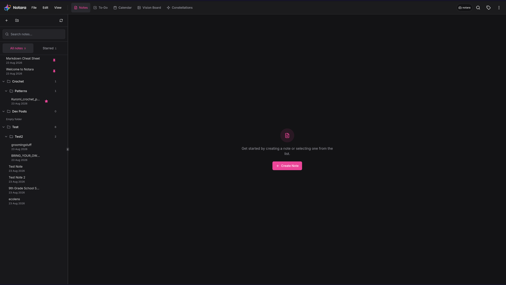

<div align="center">
  
</div>

# Notara

Notara is a local-first note workspace for Markdown notes, tasks, calendar organization, vision boards, and optional AI tools. It runs as a React web app and a Tauri desktop app for Linux and Windows.

[](https://github.com/pinkpixel-dev/notara)
[](LICENSE)



## Current features

- Markdown notes with edit, split, and preview views
- Formatting toolbar, tags, pinning, note search, in-note Find and Replace, and optional auto-save
- Task lists with dates, times, and nested items
- Calendar organization based on notes and tasks
- Vision boards with movable image and text items
- Constellation view for note relationships
- Local Tauri app-data storage and browser storage
- A context-aware OpenAI side panel that can read the open work, search the
  workspace, and propose reviewed note, task, calendar, and board changes on
  the desktop build
- Linux, Windows, Docker, and hosted web build paths

## Important current limitations

- Desktop builds use a fixed app-data workspace. They do not select an arbitrary folder.
- Open Markdown imports content into a new note. Save does not update the source file.
- JSON is the current note source. Markdown files are generated mirrors.
- Save As, external-change detection, reminders, and notifications do not exist yet.
- Notara has no account system or cloud-sync integration.
- AI needs the desktop app. Browser and Docker builds show AI as unavailable, because the API key is held by the desktop backend.
- The hosted web layout has known small-screen and keyboard-access gaps.

Read the [overhaul plan](DOCS/OVERHAUL-PLAN.md) and [roadmap](DOCS/ROADMAP.md) for the accepted direction.

## Install for development

### Requirements

- Node.js 18 or newer
- npm
- Git
- Rust toolchain for Tauri development

Debian and Ubuntu Tauri builds also need:

```bash
sudo apt-get update
sudo apt-get install -y libwebkit2gtk-4.1-dev libgtk-3-dev libayatana-appindicator3-dev librsvg2-dev patchelf
```

### Setup

```bash
git clone https://github.com/pinkpixel-dev/notara.git
cd notara
npm install
cp .env.example .env
npm run dev
```

Open `http://localhost:3489`.

The environment file holds no credentials. The OpenAI key is entered in Settings, under AI & Data.

## Desktop development

```bash
npm run tauri:dev
```

Build Linux packages:

```bash
npm run tauri:build:linux
```

The build script sets `NO_STRIP=YES` on Linux. This prevents the bundled
`linuxdeploy` strip tool from failing on current system libraries. Other
platforms keep the standard Tauri build environment.

Artifacts are written under `src-tauri/target/release/bundle/`.

Current desktop data normally lives here on Linux:

```text
~/.local/share/dev.pinkpixel.notara/workspace/
```

`XDG_DATA_HOME` can change the base path.

## Current downloads

- [Linux DEB](https://pub-7910a730d724411db0d8fb3f65278e6a.r2.dev/Notara_2.0.0_amd64.deb)
- [Linux RPM](https://pub-7910a730d724411db0d8fb3f65278e6a.r2.dev/Notara-2.0.0-1.x86_64.rpm)
- [Linux AppImage](https://pub-7910a730d724411db0d8fb3f65278e6a.r2.dev/Notara_2.0.0_amd64.AppImage)
- [Windows installer](https://pub-7910a730d724411db0d8fb3f65278e6a.r2.dev/Notara_2.0.0_x64-setup.exe)

## Docker

```bash
docker build -t notara:latest .
docker run --rm -p 3489:3489 notara:latest
```

Open `http://localhost:3489`.

The Docker runtime serves the built app and nothing else. It has no AI proxy, because AI needs the desktop backend.

## Documentation

The [documentation index](DOCS/INDEX.md) links the product, architecture, development, security, and troubleshooting guides.

The separate Astro documentation site is in `website/`. Its visual revamp is planned after the application design system is stable.

## Contributing

Read [DOCS/CONTRIBUTING.md](DOCS/CONTRIBUTING.md) before changing code. Do not commit to `main`, push, deploy, or publish without direct authorization.

## License

Notara is licensed under the [Apache License 2.0](LICENSE).

Made with 💖 by [Pink Pixel](https://pinkpixel.dev)
